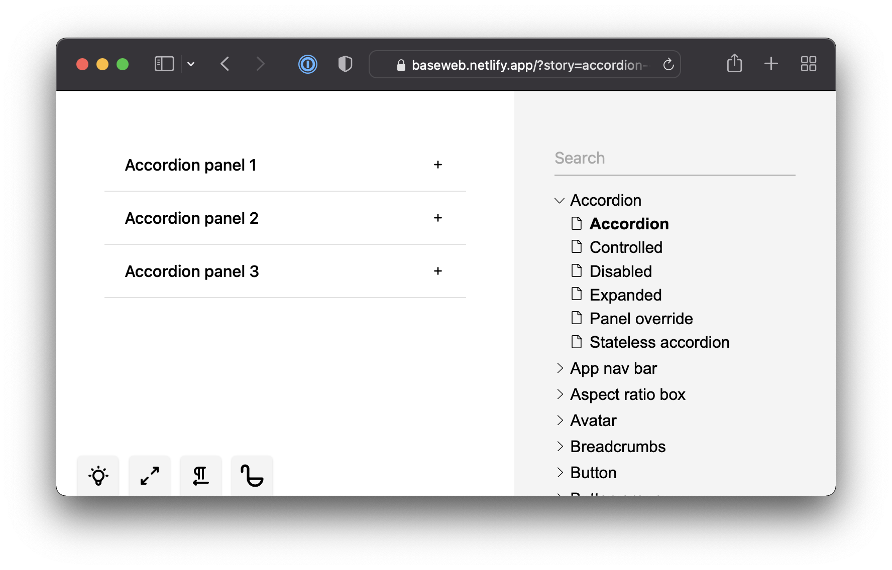

# Ginger Book

**GingerBook is a drop-in alternative to <a href="https://storybook.js.org/">Storybook</a>**. It is a tool for developing and testing your React components in an environment that's isolated and faster than most real-world applications. GingerBook also creates an index of your components, so you can easily test them through tools like <a href="https://playwright.dev/">Playwright</a>.

## Why? Performance!

GingerBook supports only React, embraces the latest standards (ES Modules) and focuses on performance. It's built around [Vite](https://vitejs.dev/) - modules are directly served to the browser and the bundling step is completely skipped. This means **instant server starts** no matter how many components it needs to load.

GingerBook still produces an optimized bundle using [rollup](https://rollupjs.org/guide/en/) when it's time to deploy it. Without adding a single component **Storybook 6.4 outputs 5.1MB of assets. GingerBook only 250KB**. GingerBook is almost 20x smaller.

Each GingerBook story gets automatically code-split, so it doesn't matter how many components you want it to handle. GingerBook always loads fast.
