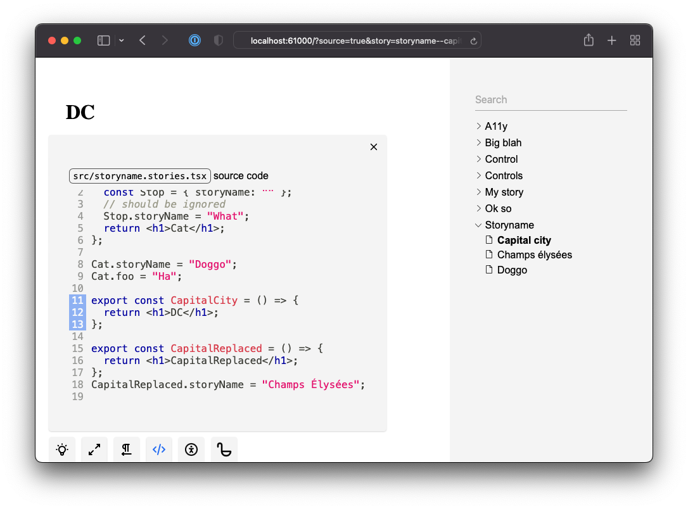

You can preview the source code of the active story and its origin.





## Hyperlink

You can customize the header of the source addon through `.ginger-book/components.tsx`:

```tsx title=".ginger-book/components.tsx"
import type { SourceHeader } from "@ginger-society/ginger-book";
export const StorySourceHeader: SourceHeader = ({ path }) => {
  return (
    <b>
      Github link? <code className="ginger-book-code">{path}</code>
    </b>
  );
};
```

This might be useful if you want provide a hyperlink.
